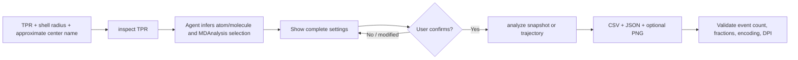
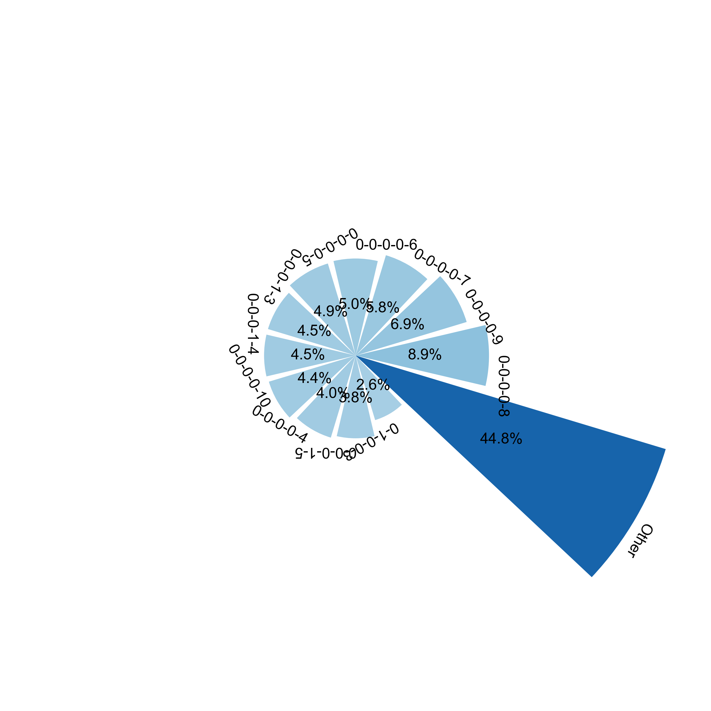

# GROMACS Solvation Environment Skill

使用 GROMACS `TPR`、用户给定的第一配位层半径，以及可选的 `XTC`/`GRO`，统计中心原子或中心分子周围的固定半径溶剂化环境组成。

该仓库既可以作为独立 Python CLI 使用，也可以安装为 Codex skill。核心计算使用 MDAnalysis，并以 TPR 中的 `molnum` 作为分子身份、`moltype` 作为 species 身份，不依赖 ITP、NDX、MOL2、VMD、`System.xlsx` 或手工 species map。

中文学术介绍：[配位环境组成统计 Skill：方法原理及其在高熵电解液中的应用](docs/academic_introduction_zh.md)

## 功能特点

- 只读检查 TPR 中的 `moltype`、`resname`、`atomname`、molecule 数量和拓扑能力。
- 支持原子中心和分子中心。
- 分子距离对象默认使用几何中心 COG，而不是质量中心 COM。
- 支持 TPR 当前帧、TPR+GRO 快照和 TPR+XTC 轨迹。
- 使用 TPR bonds 恢复跨周期边界的完整多原子分子。
- 按 molecule 去重并排除中心自身 molecule。
- 输出逐中心逐帧记录、完整环境分布、JSON 验证信息和600 DPI PNG。
- Agent 工作流强制要求：先检查、展示完整设置、获得用户确认，再运行分析。

## 工作流



`inspect` 可以在确认前执行，因为它只读拓扑且不进行配位统计。`analyze` 必须在用户明确确认设置后执行。

## 仓库结构

```text
gromacs-solvation-environment/
├── README.md
├── SKILL.md
├── requirements.txt
├── assets/
│   └── zn2_high_entropy_electrolyte/
│       ├── fig_coordination_environment_distribution.png
│       └── fig_coordination_environment_polar.png
├── agents/
│   └── openai.yaml
├── docs/
│   └── academic_introduction_zh.md
├── references/
│   └── methods_and_schema.md
└── scripts/
    ├── gromacs_solvation_environment.py
    └── smoke_test_gromacs_solvation.py
```

## 环境要求

- Python 3.11或更高版本。
- MDAnalysis 2.10.0或更高版本。
- NumPy。
- Matplotlib：仅在使用 `--plot` 时需要。
- Pillow：由 Matplotlib 通常一并安装，smoke test 用它检查PNG DPI。

推荐先检查当前环境，不要无条件升级已有科学计算环境：

```bash
python - <<'PY'
import MDAnalysis
import numpy
print("MDAnalysis", MDAnalysis.__version__)
print("NumPy", numpy.__version__)
PY
```

如需在一个已获许可的环境中安装依赖：

```bash
python -m pip install -r requirements.txt
```

## 安装为 Codex skill

克隆仓库后，将整个目录放入 Codex skills 目录，或创建符号链接：

```bash
git clone https://github.com/WangGroupFDU/solvation-environment-statistics.git
mkdir -p ~/.codex/skills
ln -s "$(pwd)/solvation-environment-statistics" \
  ~/.codex/skills/gromacs-solvation-environment
```

重新启动或刷新 Codex 后，可显式调用：

```text
Use $gromacs-solvation-environment to inspect this TPR and analyze the
first-shell composition around Zn2+ with a 0.45 nm cutoff.
```

也可以不安装 skill，直接运行仓库中的 Python CLI。

## 输入要求

| 输入 | 必需 | 说明 |
|---|---:|---|
| TPR | 是 | 提供原子、bonds、`molnum`、`moltype` 和盒信息 |
| 第一配位层半径 | 是 | 用户负责提供，CLI 统一使用 nm |
| 中心描述 | Agent 工作流必需 | 可以是近似自然语言，如“Zn2+”“锂离子”“EC分子” |
| XTC | 否 | 多帧轨迹；与 GRO 互斥 |
| GRO | 否 | 单帧坐标；与 XTC 互斥 |

如果 XTC/GRO 都未提供，程序尝试读取 TPR 内的当前帧。部分 TPR 不包含有效周期盒，此时必须提供含盒信息的 GRO 或 XTC。

## 第一步：只读检查 TPR

```bash
python scripts/gromacs_solvation_environment.py inspect \
  --tpr /absolute/path/prod_NVT.tpr
```

输出是写到标准输出的 JSON，不创建结果文件。例如：

```json
{
  "counts": {
    "atoms": 4632,
    "residues": 1146,
    "molecules": 1146,
    "bonds": 3486,
    "frames": 1
  },
  "capabilities": {
    "molnum": true,
    "moltype": true,
    "bonds": true,
    "current_coordinates": true,
    "box": false
  },
  "moltypes": [
    {
      "moltype": "Zn2+",
      "molecule_count": 40,
      "atom_count_per_molecule": [1],
      "resnames": ["MOL"],
      "atomnames": ["M_Zn_2"]
    }
  ]
}
```

Agent 应结合用户描述和这份报告判断：

- `Zn2+` 是单原子离子，因此使用 `center-mode=atom`。
- `moltype Zn2+` 和 `name M_Zn_2` 都能表示中心；前者更直接地对应用户的 species 描述。
- 不能仅凭字符串相似度自动决定选择，也不能在脚本中维护化学别名字典。

## 第二步：分析前确认

Codex/Agent 必须向用户展示完整设置，例如：

```text
请确认固定半径溶剂化环境统计设置：
- TPR: /absolute/path/prod_NVT.tpr
- Coordinates/trajectory: /absolute/path/prod_NVT.xtc
- Mode: trajectory
- First-shell radius: 0.45 nm
- Original center description: Zn2+
- Inferred center type: atom
- Resolved TPR names: moltype=Zn2+, resname=MOL, atomname=M_Zn_2
- MDAnalysis selection: moltype Zn2+
- Distance definition: atom–molecule COG
- Sampling: stride=1, all stored frames
- Output directory: /absolute/path/zn_solvation_environment
- Plot: yes

Only after you explicitly confirm these settings will I run the analysis.
```

用户修改半径、selection、轨迹、抽帧、输出目录或绘图选择后，必须重新展示完整设置并再次确认。

## 第三步：运行分析

### TPR+XTC 全轨迹

```bash
python scripts/gromacs_solvation_environment.py analyze \
  --tpr /absolute/path/prod_NVT.tpr \
  --xtc /absolute/path/prod_NVT.xtc \
  --rdf-radius-nm 0.45 \
  --center-mode atom \
  --center-selection 'moltype Zn2+' \
  --stride 1 \
  --output-dir /absolute/path/zn_solvation_environment \
  --plot
```

### TPR+GRO 单帧快照

```bash
python scripts/gromacs_solvation_environment.py analyze \
  --tpr /absolute/path/system.tpr \
  --gro /absolute/path/snapshot.gro \
  --rdf-radius-nm 0.40 \
  --center-mode molecule \
  --center-selection 'moltype EC' \
  --output-dir /absolute/path/ec_solvation_environment
```

### 轨迹抽帧

每隔10帧处理一次：

```bash
python scripts/gromacs_solvation_environment.py analyze \
  --tpr system.tpr --xtc traj.xtc \
  --rdf-radius-nm 0.35 \
  --center-mode atom --center-selection 'name LI' \
  --stride 10 \
  --output-dir results
```

从整个轨迹均匀选择20帧，并包含首尾帧：

```bash
python scripts/gromacs_solvation_environment.py analyze \
  --tpr system.tpr --xtc traj.xtc \
  --rdf-radius-nm 0.35 \
  --center-mode atom --center-selection 'name LI' \
  --n-frames 20 \
  --output-dir results
```

`--stride` 与 `--n-frames` 互斥。不提供二者时默认 `stride=1`。

## CLI 参数

### `inspect`

| 参数 | 说明 |
|---|---|
| `--tpr PATH` | 必需；待读取的 GROMACS TPR |

### `analyze`

| 参数 | 说明 |
|---|---|
| `--tpr PATH` | 必需；拓扑与 molecule identity 来源 |
| `--rdf-radius-nm FLOAT` | 必需；固定半径，单位 nm |
| `--center-mode atom\|molecule` | 必需；中心距离对象类型 |
| `--center-selection TEXT` | 必需；明确的 MDAnalysis selection |
| `--xtc PATH` | 可选；轨迹，与 GRO 互斥 |
| `--gro PATH` | 可选；单帧坐标，与 XTC 互斥 |
| `--stride N` | 可选；从第0帧开始每N帧采样 |
| `--n-frames N` | 可选；全轨迹均匀采N帧 |
| `--output-dir PATH` | 必需；结果目录 |
| `--plot` | 可选；生成两张600 DPI PNG |

## 距离和计数定义

1. MDAnalysis 内部坐标使用 Å；输入半径从 nm 乘10转换为 Å。
2. 全体系原子按 TPR `molnum` 分组；一个 molecule 必须且只能对应一个 `moltype`。
3. 多原子 molecule 必须由 TPR bonds 连通。
4. 每一帧沿成键生成树逐键应用最小镜像位移，恢复跨 PBC 的完整 molecule。
5. molecule COG 是完整 molecule 全部原子坐标的非质量加权算术平均。
6. 原子中心使用原子坐标；分子中心用 selection 识别 `molnum` 后扩展至完整 molecule COG。
7. 所有邻居均使用 molecule COG，通过当前帧周期盒执行稀疏 cutoff 搜索。
8. 排除中心自己的 `molnum`，但保留其他相同 `moltype` 的 molecule。
9. 每个邻居 `molnum` 在一个中心–帧事件中最多计数一次。

重要含义：对于聚合物等大分子，计数表示整个分子的 COG 进入 cutoff，而不是任意局部原子进入 cutoff。如果研究问题需要局部接触距离，应使用另一套明确定义的方法，不应把本结果解释为局部原子配位。

半径必须大于0，且不能超过当前帧最短晶格向量长度的一半。

## 输出文件

### `solvation_environment_records.csv`

每一行对应一个中心–帧事件，包括：

- 帧和时间：`event_id`、`sample_index`、`frame_index`、`time_ps`；
- 中心身份：`center_id`、`center_atom_index`、`center_molnum`、`center_moltype`；
- 环境：`total_neighbor_molecules`、`environment_type_id`、`composition_json`；
- 每种 species 的整数列：`count::<moltype>`。

### `solvation_environment_distribution.csv`

每一行对应一个唯一的完整组成向量，包括次数、全事件比例和逐species计数。

环境类型按出现次数降序排列；次数相同时按组成向量字典序排列。`environment_type_id` 从1开始。

### `solvation_environment_summary.json`

保存：

- 已确认的 CLI 参数；
- selection 实际解析结果；
- species 顺序；
- 抽帧索引；
- 完整环境分布；
- 输出路径；
- 事件数和比例验证信息；
- 绘图长尾合并策略。

### 图像

- `fig_coordination_environment_distribution.png`：推荐主图；显示最高频11类，其余类型合并为 `Other`。
- `fig_coordination_environment_polar.png`：同一分布的极坐标表达。

图中的 `Other` 只用于可视化。CSV/JSON 始终保存完整、未合并的所有环境类型。

## Zn2+高熵电解液：真实分析示例

本节展示一个已经实际运行和验证的 Zn²⁺体系案例，案例名称为 **Zn2+高熵电解液**。这里的“高熵电解液”是体系名称；本程序统计固定半径内的分子组成，并不直接计算热力学熵。

### 体系组成

`inspect` 从 TPR 解析出的 molecule 组成如下。分子身份和 species 名称均来自 TPR 的 `molnum` 与 `moltype`，未读取 `System.xlsx` 或手工 species map。

| moltype | molecule 数量 | 每个 molecule 的原子数 |
|---|---:|---:|
| PAM | 6 | 152 |
| Zn2+ | 40 | 1 |
| Gly | 20 | 14 |
| ClO4- | 80 | 5 |
| H2O | 1000 | 3 |
| **总计** | **1146** | **4632 个原子** |

### 已确认的分析设置

| 设置 | 取值 |
|---|---|
| 坐标模式 | TPR+XTC trajectory |
| 中心 | Zn²⁺单原子 molecule |
| MDAnalysis selection | `moltype Zn2+` |
| 第一配位层半径 | 0.45 nm |
| 距离定义 | Zn²⁺原子坐标–邻居 molecule COG |
| 采样 | 30 个存储帧全部处理，`stride=1` |
| 中心数量 | 每帧 40 个 Zn²⁺ |
| 绘图 | 是，输出两张 600 DPI PNG |

为避免公开真实服务器路径，下面使用相对路径复现相同设置：

```bash
python scripts/gromacs_solvation_environment.py analyze \
  --tpr ./prod_NVT.tpr \
  --xtc ./prod_NVT.xtc \
  --rdf-radius-nm 0.45 \
  --center-mode atom \
  --center-selection 'moltype Zn2+' \
  --stride 1 \
  --output-dir ./zn2_high_entropy_electrolyte_results \
  --plot
```

### 统计结果

40 个中心乘以 30 帧，共得到 1200 个中心–帧事件和 87 种完整环境组成。出现频率最高的 11 种环境如下；百分比的分母始终为全部 1200 个事件。

| 排名 | 第一配位层组成 | 次数 | 比例 |
|---:|---|---:|---:|
| 1 | H2O=8 | 107 | 8.9% |
| 2 | H2O=9 | 83 | 6.9% |
| 3 | H2O=7 | 69 | 5.8% |
| 4 | H2O=6 | 60 | 5.0% |
| 5 | H2O=5 | 59 | 4.9% |
| 6 | ClO4-=1, H2O=3 | 54 | 4.5% |
| 7 | ClO4-=1, H2O=4 | 54 | 4.5% |
| 8 | H2O=10 | 53 | 4.4% |
| 9 | H2O=4 | 48 | 4.0% |
| 10 | ClO4-=1, H2O=5 | 45 | 3.8% |
| 11 | Zn2+=1, H2O=3 | 31 | 2.6% |

验证不变量全部通过：

```text
expected_total_events = 40 centers × 30 frames = 1200
actual_total_events   = 1200
unique_environments   = 87
fraction_sum          = 1.0000000000000004
self molecule         = excluded in every center–frame event
```

在当前 0.45 nm 和 molecule-COG 定义下，单一类型中最常见的是 `H2O=8`，占全部事件的 8.9%。前 11 种类型合计占 55.2%；其余 76 种低频类型在图中合并为 `Other`，合计占 44.8%，表明该体系存在明显的组成长尾。该结论描述的是 **Zn²⁺原子到完整分子 COG 的固定半径统计**，不应解释为 Zn–O 原子配位数。

### 环境组成分布图

横向分布图直接显示最高频 11 类，并将其余 76 类合并为 `Other`。这是更适合阅读具体组成标签的主图。


### 极坐标图

极坐标图使用同一组频率数据，扇区标签按 species 顺序 `PAM-Zn2+-Gly-ClO4--H2O` 表示完整组成向量；例如 `0-0-0-0-8` 表示 8 个 H2O molecule。



图中的 `Other` 仅用于展示。完整的 87 种环境及其精确比例应从 `solvation_environment_distribution.csv` 与 `solvation_environment_summary.json` 读取，不能从合并后的图中反推。

## 验证

运行不需要真实 TPR/XTC 的确定性 smoke test：

```bash
python scripts/smoke_test_gromacs_solvation.py
```

测试覆盖：

- TPR 类似的 `molnum`/`moltype`/bonds 语义；
- atom center 与 molecule center；
- selection 只选分子部分原子时扩展至完整 molecule；
- 跨 PBC 分子 COG；
- 中心自身排除及相同 species 保留；
- 默认、stride 和均匀抽帧；
- 事件数和比例不变量；
- RFC 4180、UTF-8 BOM、CRLF；
- 两张600 DPI PNG；
- 不生成 PDF。

验证 skill 结构：

```bash
python /path/to/skill-creator/scripts/quick_validate.py .
```

## 常见错误

### `TPR current coordinates cannot be read`

补充 `--gro` 或 `--xtc`，并重新确认设置。

### `missing valid periodic box`

当前坐标源没有有效盒信息。使用带盒的 GRO/XTC，不能关闭 PBC 校验来绕过。

### `multi-atom molecule ... bonds disconnected`

TPR 中该 `molnum` 的 bonds 不连通，无法唯一恢复跨 PBC 分子。检查 TPR 是否对应正确体系，不要静默改用 residue 分组。

### `cutoff exceeds half the shortest lattice vector`

该半径违反最小镜像约束。检查单位和盒尺寸，不要直接强行增大限制。

### 环境类型过多

完整类型仍写入 CSV/JSON。图中只显示高频类型并合并长尾，避免标签重叠。

## 数据与隐私

`.gitignore` 默认排除 TPR、XTC、TRR、GRO、EDR、CPT 和常见结果目录，避免把大型轨迹或私有模拟数据误提交到 GitHub。发布前仍应执行：

```bash
git status --short
git ls-files
```

确认仓库只包含 skill 源码、文档和无敏感信息的示例。
