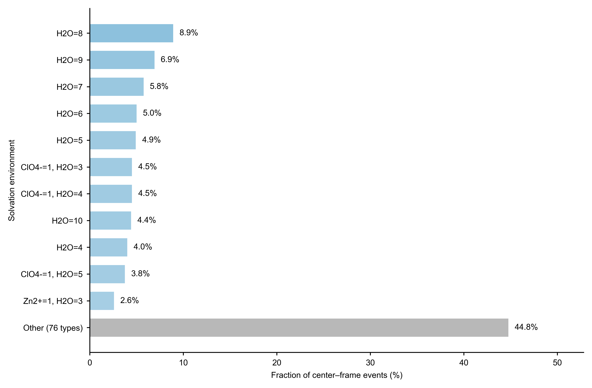

# 配位环境组成统计 Skill：方法原理及其在高熵电解液中的应用

在分子动力学模拟中，平均配位数可以反映中心粒子周围邻近组分的总体数量，但难以描述不同局域构型之间的差异。对于组分复杂、配位状态丰富的电解液体系，仅依赖平均值可能掩盖大量低频但具有实际意义的溶剂化结构。该 Skill 基于 MDAnalysis，从 GROMACS 的 TPR 拓扑和 XTC 轨迹中提取中心原子或中心分子的第一配位层组成，并将连续轨迹转化为可统计的离散环境类型，从而定量描述局域溶剂化结构的分布及其异质性。

## 统计原理

分析首先使用 TPR 中的 `molnum` 区分独立分子，并以 `moltype` 标识分子所属物种。对于跨越周期性边界的多原子分子，程序根据成键拓扑逐键应用最小镜像位移，恢复完整分子后再计算非质量加权几何中心（center of geometry，COG）：

$$
\mathbf{R}_m(t)=\frac{1}{N_m}\sum_{a\in m}\widetilde{\mathbf{r}}_a(t),
$$

其中，$N_m$ 为分子 $m$ 的原子数，$\widetilde{\mathbf{r}}_a(t)$ 为经过周期性边界修复的原子坐标。若中心为原子，则直接使用该原子的坐标；若中心为分子，则使用完整分子的 COG。所有邻居均以完整分子的 COG 作为距离对象。

在给定第一配位层半径 $r_c$ 后，对每一个中心 $c$ 和轨迹帧 $t$，统计不同物种 $s$ 在周期性距离范围内的分子数：

$$
n_s(c,t)=\sum_{m\in s,\,m\ne m_c}
\mathbf{1}\!\left[d_{\mathrm{PBC}}\!\left(\mathbf{R}_c,\mathbf{R}_m\right)\le r_c\right].
$$

中心自身所在分子会被排除，每个邻居分子在同一中心–帧事件中最多计数一次。由各物种计数构成的向量
$\mathbf{n}(c,t)=[n_1,n_2,\ldots,n_S]$ 即为该事件的配位环境。具有相同完整组成向量的事件被归为同一种环境，其出现概率为

$$
p_i=\frac{N_i}{N_{\mathrm{event}}},\qquad
N_{\mathrm{event}}=N_{\mathrm{center}}N_{\mathrm{frame}}.
$$

因此，该方法不仅能够给出平均邻居数量，还能保留每一种完整配位组成及其统计权重。

## 在高熵电解液中的应用

高熵电解液通常包含多种溶剂、盐和功能组分，其局域结构往往呈现显著的动态异质性。不同组分可能竞争进入中心离子的第一配位层，并形成溶剂主导、阴离子参与或离子缔合等多种环境。传统平均配位数会将这些差异压缩为单一数值，而环境组成分布能够直接识别主要溶剂化构型、比较溶剂与阴离子的配位竞争，并判断体系是由少数优势环境主导，还是由大量低频构型共同组成。

在统一配位半径、物种定义和采样策略的条件下，该分布还可用于比较不同电解液配方的局域结构多样性，并作为研究溶剂化结构与离子输运、去溶剂化和界面反应之间关系的结构描述符。

## Zn2+高熵电解液示例

在 Zn2+高熵电解液案例中，体系包含 PAM、Zn²⁺、Gly、ClO₄⁻和 H₂O。分析采用 0.45 nm 的第一配位层半径，对40个 Zn²⁺中心和30个轨迹帧进行统计，共获得1200个中心–帧事件及87种不同的配位环境。

出现频率最高的单一环境由8个 H₂O 分子组成，占全部事件的8.9%。频率最高的11种环境合计占55.2%，其余76种低频环境合计占44.8%。这一明显的长尾分布表明，Zn²⁺周围不存在占绝对优势的单一局域构型，而是形成了由水分子、阴离子和其他组分共同参与的多样化溶剂化环境。

*图1｜Zn2+高熵电解液中 Zn²⁺第一配位层的环境组成分布。图中分别展示出现频率最高的11种环境，其余76种低频环境合并为“Other”；所有比例均以1200个中心–帧事件为统计基准。*

需要注意的是，该案例采用 Zn²⁺原子到完整分子 COG 的距离判据，所得环境组成不等同于基于 Zn–O 原子距离定义的传统原子配位数。

## 环境熵与相对自由能

环境概率分布可以进一步用于衡量局域溶剂化结构的多样性。例如，环境构型熵可定义为

$$
S_{\mathrm{env}}=-k_{\mathrm{B}}\sum_i p_i\ln p_i.
$$

$S_{\mathrm{env}}$ 越大，表示具有显著统计权重的环境类型越丰富、概率分布越分散。它描述的是局域溶剂化环境的分布熵，而不是整个模拟体系的总热力学熵。

同一概率分布还可通过反演玻尔兹曼关系映射为环境类型的相对自由能：

$$
\Delta G_i=-k_{\mathrm{B}}T\ln\left(\frac{p_i}{p_{\mathrm{ref}}}\right),
$$

其中，$p_{\mathrm{ref}}$ 为参考环境的概率。该关系有助于比较不同局域构型的相对稳定性，但其可靠性取决于轨迹采样是否充分，特别是对低频环境的概率估计是否收敛。

## 总结

该 Skill 将分子动力学轨迹中的局域结构转化为分子层面的配位组成及概率分布，在保留环境异质性的同时提供了直观、可比较的统计结果。它适用于高熵电解液、多组分电解液及其他复杂溶剂体系，可用于识别优势溶剂化构型、分析组分竞争，并为环境熵和相对自由能等进一步表征提供数据基础。
